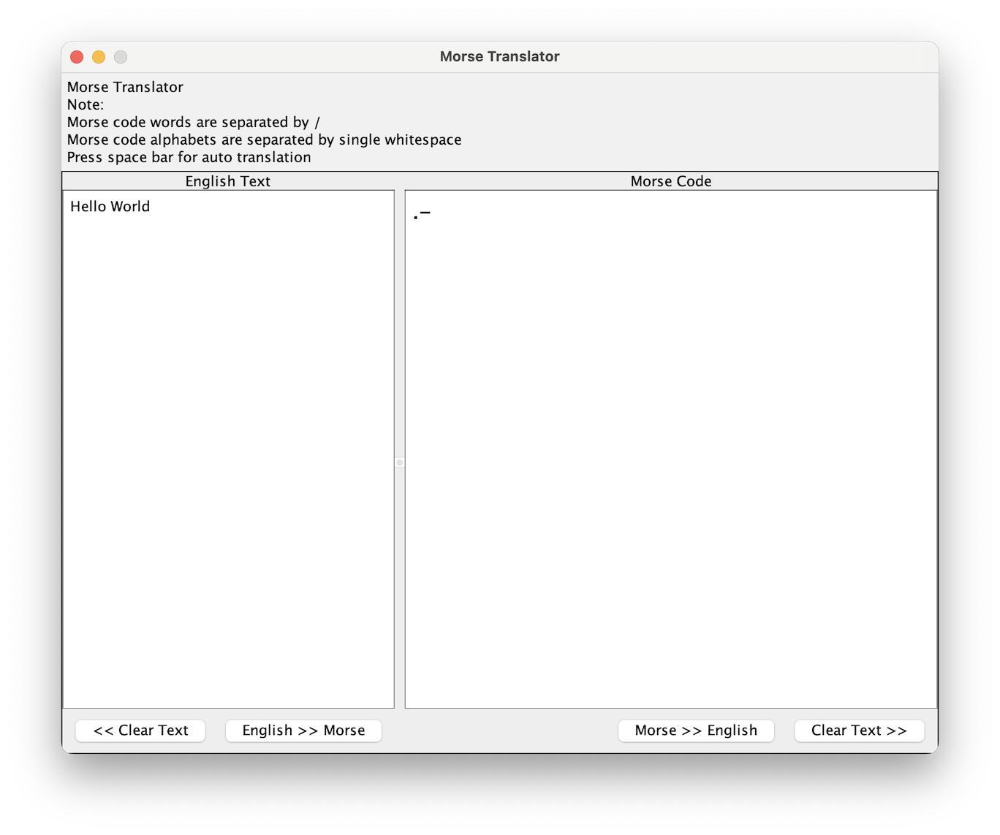

Morse Code Translator
=====================

A Kotlin Swing GUI desktop app that can translate English text to 
Morse and vice-versa.



How to run the application
==========================

```shell
./gradlew run
```

Usage
=====

English to Morse Code
---------------------

Type English text in the text area provided. When you press
space bar, the text will automatically be converted into
Morse code and displayed in the text area to the right. Each
English character is separated by white space in morse code
and space between English words is translated as '/' in the
generated morse code.

Morse Code to English
---------------------

You can clear the existing morse code in the text area with 
a button at the bottom of the app. 

Type the morse code in the text area to the right. Separate morse code for each letter by a space. '/' denotes
a space between words.

-------
Inspiration: https://github.com/SeunMatt/morsecodetranslator